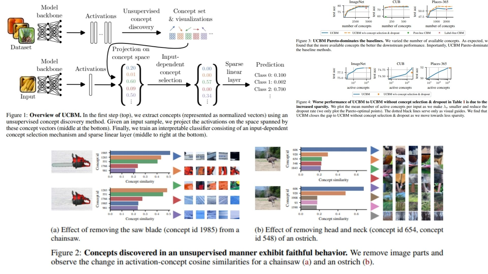

# 🌀 UCBM-Concept-Replication — Unsupervised Concept Bottleneck Models

This repository provides a **faithful PyTorch replication** of the  
**Concept Bottleneck Models without predefined concepts**, following the paper *Concept Bottleneck Models Without Predefined Concepts*.  

The goal is to **replicate the concept discovery, input-dependent gating, and sparse linear classifier** exactly as described, without running actual training or testing.  
The code is modular, interpretable, and ideal for research, experimentation, or educational purposes.

Highlights include:

* Backbone \(f(x)\) producing activations \(A\)  
* Concept extraction via **Non-negative Matrix Factorization (NMF)**: $$A \approx U C^T$$  
* Input-dependent concept gating: $$\pi(x) = \max(0, \text{proj}_C f(x) - o)$$  
* Sparse linear classification layer mapping active concepts to outputs  
* Fully PyTorch-compatible, lightweight, and modular  

Paper reference: *[Concept Bottleneck Models Without Predefined Concepts](https://arxiv.org/abs/2407.03921)*  

---

## Overview — UCBM Forward Pass 🌌



> The model first discovers concepts from activations, projects activations onto these concept vectors, selectively gates concepts per input, and finally classifies using a sparse linear layer.  

The pipeline improves interpretability by:

* Learning **concept space** unsupervised, no human annotations needed  
* Dynamically selecting concepts per input via gating  
* Computing classification linearly with respect to active concepts only  
* Enforcing sparsity both **per class** and **across all classes**  

---

## Core Mathematical Formulations 📐

- **Backbone mapping:**

$$
f: x \in \mathbb{R}^{B \times C \times H \times W} \longrightarrow A \in \mathbb{R}^{B \times p}
$$

- **Concept discovery (NMF):**

```math
(U^*, C^*) = \arg \min_{U, C \ge 0} \|A - U C^\top\|_F^2
```


- **Projection onto concepts:**

$$
\text{proj}_C f(x) = \frac{A \cdot C}{||A|| \, ||C||} \quad \text{(cosine similarity)}
$$

- **Input-dependent gating:**

$$
\pi(x) = \max(0, \text{proj}_C f(x) - o)
$$

- **Sparse linear classification:**

$$
y = W \pi(x) + b
$$

- **Regularization (elastic net) applied to** $$W$$ **and** $$\pi(x)$$  

---

## Why UCBM Matters 🌿

* Enables **concept-based interpretability** without annotated concepts  
* Selectively uses a **small subset of concepts per input**  
* Fully **modular and transparent**, ideal for research or educational use  
* Supports experiments with arbitrary pretrained backbones  

---

## Repository Structure 🏗️

```bash
UCBM-Concept-Replication/
├── src/
│   ├── layers/
│   │   ├── backbone.py              # f(x): pretrained model → activation A
│   │   ├── projection.py            # proj_C: cosine similarity
│   │   ├── gating.py                # π(x): ReLU(proj - o)
│   │   └── linear.py                # sparse linear layer W,b
│   │
│   ├── concept/
│   │   ├── nmf.py                   # A ≈ U C^T
│   │   └── concept_builder.py       # activation → concept matrix C
│   │
│   ├── pipeline/
│   │   └── forward_pass.py          # full flow (single sample demo)
│   │
│   └── config.py                     # Hyperparameters: latent dim, α, gating offset
│   
├── images/
│   └── figmix.jpg
│
├── requirements.txt
└── README.md
```

---

## 🔗 Feedback

For questions or feedback, contact:  
[barkin.adiguzel@gmail.com](mailto:barkin.adiguzel@gmail.com)
